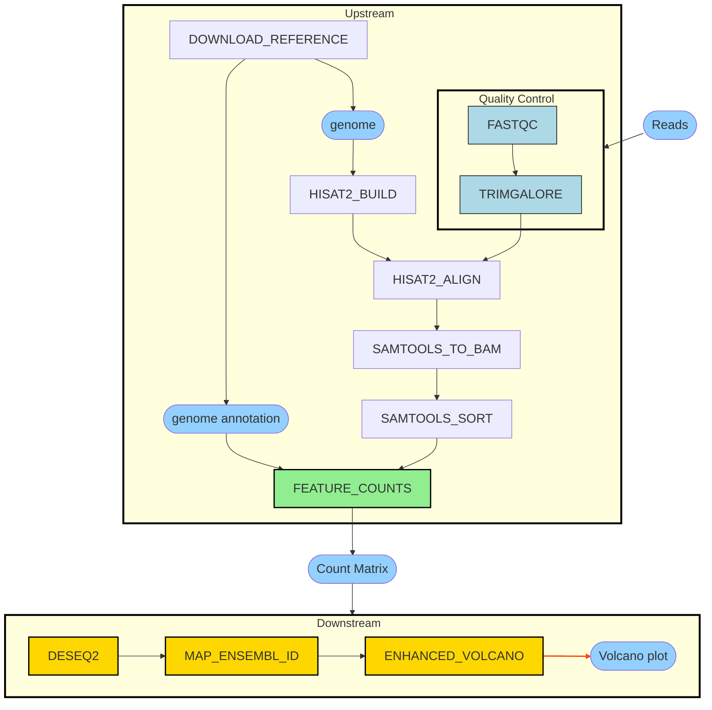
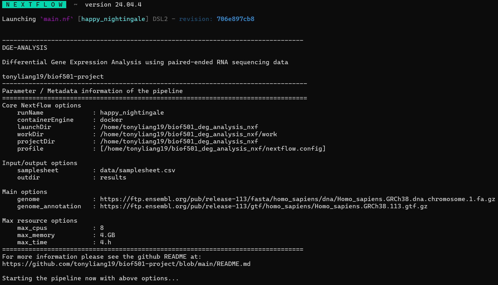
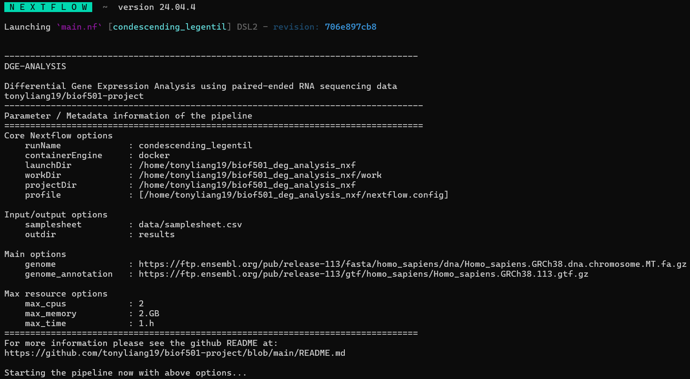
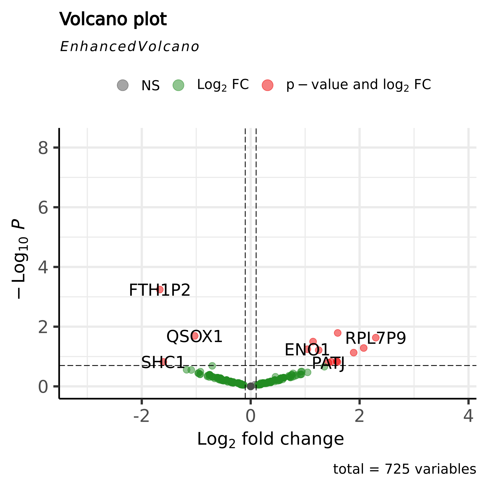

# Differential Gene Expression Analysis on Paired-end RNA-Seq Data

Author: Tony Liang

---

**Table of Contents**:

1. [Project Outline](#project-outline)
1. [Workflow Overview](#workflow-overview)
1. [Repository Structure](#repository-structure)
1. [Setup](#setup)
1. [Preparing Input](#preparing-input)
1. [Running Instructions](#running-instruction)
1. [Expected Pipeline Output](#pipeline-output)
1. [Reference](#reference)

## Project Outline

### Introduction

Technological advances have enabled easy access to high-throughput transcriptome sequencing (RNA-Seq). It provides far higher coverage and greater resolution of the dynamic nature of transcriptome compared to previous microarray-based methods like Sanger sequencing [1]. RNA-Seq allows us to compare specific conditions and understand phenotypic variation through quantifying differentially expressed genes (DEGs) [2]. However, this process of sequencing data to counts of DEGs could vary a lot depending on input sequence data type, protocol, or library strategy.  Due to these sources of variations, many existing tools identify DEGs from RNA-seq data but are not standardized as a modular, reproducible workflow. This modular feature allows simple replacement of tools to examine effects like alignment strategy, mapping reads, etc.

Here, we introduce a Nextflow pipeline **DGE-analysis** that takes in paired-end RNA-sequencing data in FATSQ format, transforming it to gene counts matrix across different conditions from biological sample, and presenting a nice volcano plot [3] of DEGs. 

In short, this pipeline tries to solve these aims:

1. Reproducible workflow, pinning the versions of software used, as results differ from one to other versions.
2. Interoperability, running under various system configurations and resource allocations without modifying the logic.
3. Modular, replacing any software of interest in the pipeline as long it solves the same task like alignment, plotting, or different analysis tool.


### Workflow Overview




Above is the workflow steps overview of how from raw FASTQ files, we get to count matrix through the list of bioinformatics tools (see [tools reference](tools-citations.md)) with these steps:

1. Given a pair of FASTQ reads of sequencing files, check their qualities through **FastQC** and remove low-quality reads with **Trim Galore**
2. At the same time, the reference genome and its annotation are downloaded from the internet, the `genome` is a parameter of the pipeline, which can be any other URL pointing to a homo-sapiens genome.
3. The genome index is built using **HISAT2** to allow for quicker location of query sequences in the reference genome.
4. Then align trimmed reads of each sample from 1. and the built genome index from 3. using **HISAT2**. This step is separated from 3. to decouple the indexing and alignment logic.
5. Then convert the aligned sequence alignment map (SAM) for each sample from 4. to binary alignment map (BAM) using **Samtools**, to have a compressed binary representation of 4. and allow for faster computational time.
6. Then sort BAM from 5. using **Samtools**, again for the sake of decoupling logic of conversion of file formats and sorting the BAM file.
7. Now, using all the BAM files and the downloaded annotation file of the genome, we count mapped reads for genomic features using **featureCounts**, and obtain such count matrix where rows are genes in ensembl id format, and columns are samples.
8. Next, we could use the count matrix from 7. to estimate variance-mean dependence and test for differential expression using **DESeq2**, here we output log2 fold change (log2FC) of genes along with their pvalue, and ensembl id.
9. Ensembl ids are mapped to gene symbols based on the existing genome-wide annotation of Homo-Sapiens at **org.Hs.eg.db** , for better interpretability of later visualizations.
10. Lastly, a volcano plot is produced via **EnhancedVolcano** to see which genes are differentially expressed, i.e. differ significantly between conditions by looking at the combination of the provided Pvalue and log2FC.


## Repository Structure

The following illustrates the tree structure of this repository, those that end with `/` symbol are directories, otherwise, it is treated as a regular file. 

This structure is adapted from **nf-core** standard workflow from the [rnaseq](https://github.com/nf-core/rnaseq/tree/master) repository.


<details>
  <summary>See the repository file structure</summary>

```bash
./
├── Makefile
├── README.md
├── assets
│   ├── default_profile_run_log.png
│   └── test_profile_run_log.png
├── bin
│   ├── README.md
│   ├── deseq2_analysis.R
│   ├── featureCounts.R
│   ├── map_ensembl_id.R
│   └── plot_volcano.R
├── conf
│   ├── README.md
│   ├── base.config
│   └── test.config
├── data
│   ├── Homo_sapiens.GRCh38.113.gtf.gz
│   ├── Homo_sapiens.GRCh38.dna.chromosome.1.fa.gz
│   ├── Homo_sapiens.GRCh38.dna.chromosome.MT.fa.gz
│   ├── README.md
│   ├── SRR29891674_sample_1.FASTQ.gz
│   ├── SRR29891674_sample_2.FASTQ.gz
│   ├── SRR29891675_sample_1.FASTQ.gz
│   ├── SRR29891675_sample_2.FASTQ.gz
│   ├── SRR29891677_sample_1.FASTQ.gz
│   ├── SRR29891677_sample_2.FASTQ.gz
│   ├── SRR29891678_sample_1.FASTQ.gz
│   ├── SRR29891678_sample_2.FASTQ.gz
│   ├── metadata.csv
│   └── samplesheet.csv
├── main.nf
├── modules
│   ├── README.md
│   ├── local
│   └── nf-core
├── Nextflow.config
├── results
│   ├── README.md
│   ├── deseq2
│   ├── enhanced_volcano
│   ├── FASTQc
│   ├── feature_counts
│   ├── hisat2_align
│   ├── hisat2_build
│   ├── map_ensembl_id
│   ├── pipeline_info
│   ├── samtools_sort
│   ├── samtools_to_bam
│   └── trimgalore
└── run_nxf.sh
```

</details>

### Directories

- `bin`: This directory contains **executable** binary scripts used in the processes, provided you have the relevant binary installed like `Rscript` or `python3`. For more information please see [here](bin/README.md).

- `modules`: This directory contains Nextflow processes definitions following these conventions:
    - `local/<tool_name>/main.nf`: `<tool_name>` would be an actual binary tool that could be treated as the smallest unit software to use in the workflow, and contains the implementation of using these tools based on its documentation/manual.
    - `nf-core/main.nf`: Code adapted from [nf-core/rnaseq](https://github.com/nf-core/rnaseq/blob/master/subworkflows/nf-core/utils_Nextflow_pipeline/main.nf) under [MIT License](https://github.com/nf-core/rnaseq/blob/master/LICENSE), this stores standard code used across nf-core pipelines to record workflow/tools version numbers and some useful utilities.
    - For more information, see the [README here](./modules/README.md)

- `data`: This directory contains a test samplesheet CSV (input of the workflow) and other small test data to run the workflow. For more detailed documentation on how these data were gathered, please the the [README here](./data/README.md)

- `conf`: This directory contains Nextflow configuration parameters, it is designed to store different profiles (i.e. running the pipeline under different infrastructure settings). This follows nf-core standard practice, where these configs are then just sourced in the main [top-level configuration](./Nextflow.config) upon command-line usage. For more information, see [README here](./conf/README.md)
    - [`base.config`](./conf/base.config): This is a basic configuration that declares resource usages, and it is intended to be overridden by other profiles
    - [`test.config`](./conf/test.config): This is a configuration designed to be run on a small dataset (i.e. our sample data this case), with limited resource settings


## Setup

There are some software dependencies to run this pipeline, corresponding software and versions are tested in the following:

```bash
# <sofware>-<version_number>
bash-5.1.16
java-11.0.22
Docker--20.10.23
git-2.34.1
Nextflow-24.04.4
```

Other tools used in the pipeline are from public repository docker images retrieved mostly from the [biocontainers organization](https://quay.io/organization/biocontainers).

For a list of software images used in this pipeline see the configuration file [here](Nextflow.config) under the `process` scope.

### Preparing Input

First, prepare a samplesheet with your input data that looks as follows:

**data/samplesheet.csv**:

```csv
sample_name,condition,rep,FASTQ1,FASTQ2
SRR29891678,control,rep1,data/SRR29891678_sample_1.FASTQ.gz,data/SRR29891678_sample_2.FASTQ.gz
SRR29891677,control,rep2,data/SRR29891677_sample_1.FASTQ.gz,data/SRR29891677_sample_2.FASTQ.gz
SRR29891675,treatment,rep1,data/SRR29891675_sample_1.FASTQ.gz,data/SRR29891675_sample_2.FASTQ.gz
SRR29891674,treatment,rep2,data/SRR29891674_sample_1.FASTQ.gz,data/SRR29891674_sample_2.FASTQ.gz
```

The `sample_name` here represents sequence read archive (SRA) accession code, in this case, `SRR*` are sequencing runs from NCBI's database. And, this samplesheet should also contain information like the condition that the sample represents (one of control or treatment) and its biological replicate number
with the prefix `rep`. Lastly, it should have two columns indicating the path to the `FASTQ.gz` of both read1 and read2, as the pipeline required paired-end sequencing data.

For more information on how this samplesheet was constructed, see its [README here](data/README.md).

### Running Instruction

First, clone this GitHub repository and change the working directory to the clone repo using:

```bash
# Assuming you use one of bash/zsh or other unix systems
# NO Powershell
git clone https://github.com/tonyliang19/biof501-project.git
cd biof501-project/
```

Then the pipeline could be run as the following using test data contained already in this repository:

```bash
# The outdir could also be replace to some other directory of your preference
# Profile represents sets of configuration parameters, could be chained by prof1,prof2,...
Nextflow run main.nf \
    --samplesheet data/samplesheet.csv \
    --outdir results \
    -profile docker
```

Overall the running command should follow this structure:

```bash
Nextflow run main.nf \
    --samplesheet <SOME_SAMPLESHEET_CSV> \
    --outdir <OUTDIR> \
    -profile docker
```

where `<SOME_SAMPLESHEET_CSV>` is the CSV data that follows the format in [preparing-input section](#preparing-input) and `OUTDIR` is the directory you want the output files to store.

> [!NOTE]
> The pipeline should take some time to run for the very first time, because of the containerized images it has to pull from the internet, and downloads of some reference data.
>
> Also the profile there should be NO SPACE, i.e.:
>
> -profile docker,test **works**
>
> -profile docker, test **DO NOT WORK**

Alternatively, if you prefer a quick way to run the pipeline, there is a built-in script [`run_nxf.sh`](run_nxf.sh), where you could simply execute it:

```bash
bash run_nxf.sh # This would run the under default options above
# If you want to resume run the pipeline, use the -r option like:
bash run_nxf.sh -r
# Or for a faster run of the pipeline use a smaller reference genome file by changing the profile config
# Edit the PROFILE to PROFILE=docker,test and run with:
bash run_nxf.sh
# Equivatlently to
Nextflow run main.nf \
    --samplesheet data/samplesheet.csv \
    --outdir results \
    -profile docker,test
```

## Pipeline Output

There are two pre-defined configuration profiles, each of them varied by the genome fasta used. By default, the `Chr1` is used as the reference genome. If specified the `test` profile, the `ChrMT` is used as the reference genome. 

> [!IMPORTANT]
> These results here **DO NOT represent** biological relevance, since the input FASTQ files are sampled following this [doc](data/README.md#sample-data)
> 


When the pipeline runs, it emits the following logs detailing which parameters were used or which profiles used:


For the **default** option run:




For the **test profile** option run:



---

> [!NOTE]
> Here, we only present the expected outputs for the **default** profile and not the test.
> 

The end goal volcano plot should look like this:




The detailed software versions used and collected from the pipeline are stored under `results/pipeline_info/dge_analysis_versions.yml` and its contents should be:

```bash
Workflow:
    dge-analysis:
    Nextflow: 24.04.4
TRIMGALORE:
  trimgalore: 0.6.7
  cutadapt: 3.4
FASTQC:
  FASTQc: 0.12.1
HISAT2_BUILD:
  hisat2-build: 2.2.0
HISAT2_ALIGN:
  hisat2: 2.2.0
SAMTOOLS_TO_BAM:
  samtools: 1.21
SAMTOOLS_SORT:
  samtools: 1.21
FEATURE_COUNTS:
  R: 4.0.3
  Rsubread: 2.4.0
DESEQ2:
  R: 4.3.3
  DESeq2: 1.42.0
MAP_ENSEMBL_ID:
  R: 4.3.2
  org.Hs.eg.db: 3.18.0
ENHANCED_VOLCANO:
  R: 4.3.2
  EnhancedVolcano: 1.20.0
  ggplot2: 3.4.4
```

The directory structure of the output directory at `results` should be:

```bash
results/
├── README.md
├── deseq2
│   └── deseq2_result.csv
├── enhanced_volcano
│   └── volcano_plot.png
├── FASTQc
│   ├── SRR29891674
│   │   ├── SRR29891674_sample_1_FASTQc.html
│   │   ├── SRR29891674_sample_1_FASTQc.zip
│   │   ├── SRR29891674_sample_2_FASTQc.html
│   │   └── SRR29891674_sample_2_FASTQc.zip
│   ├── SRR29891675
│   │   ├── SRR29891675_sample_1_FASTQc.html
│   │   ├── SRR29891675_sample_1_FASTQc.zip
│   │   ├── SRR29891675_sample_2_FASTQc.html
│   │   └── SRR29891675_sample_2_FASTQc.zip
│   ├── SRR29891677
│   │   ├── SRR29891677_sample_1_FASTQc.html
│   │   ├── SRR29891677_sample_1_FASTQc.zip
│   │   ├── SRR29891677_sample_2_FASTQc.html
│   │   └── SRR29891677_sample_2_FASTQc.zip
│   └── SRR29891678
│       ├── SRR29891678_sample_1_FASTQc.html
│       ├── SRR29891678_sample_1_FASTQc.zip
│       ├── SRR29891678_sample_2_FASTQc.html
│       └── SRR29891678_sample_2_FASTQc.zip
├── feature_counts
│   ├── feature_counts.log
│   └── feature_counts.rds
├── hisat2_align
│   ├── SRR29891674
│   │   ├── SRR29891674.sam
│   │   └── hisat2-SRR29891674.log
│   ├── SRR29891675
│   │   ├── SRR29891675.sam
│   │   └── hisat2-SRR29891675.log
│   ├── SRR29891677
│   │   ├── SRR29891677.sam
│   │   └── hisat2-SRR29891677.log
│   └── SRR29891678
│       ├── SRR29891678.sam
│       └── hisat2-SRR29891678.log
├── hisat2_build
│   └── hisat2
│       ├── Homo_sapiens.GRCh38.dna.chromosome.1.fa.1.ht2
│       ├── Homo_sapiens.GRCh38.dna.chromosome.1.fa.2.ht2
│       ├── Homo_sapiens.GRCh38.dna.chromosome.1.fa.3.ht2
│       ├── Homo_sapiens.GRCh38.dna.chromosome.1.fa.4.ht2
│       ├── Homo_sapiens.GRCh38.dna.chromosome.1.fa.5.ht2
│       ├── Homo_sapiens.GRCh38.dna.chromosome.1.fa.6.ht2
│       ├── Homo_sapiens.GRCh38.dna.chromosome.1.fa.7.ht2
│       └── Homo_sapiens.GRCh38.dna.chromosome.1.fa.8.ht2
├── map_ensembl_id
│   └── mapped_id_deseq_result.csv
├── pipeline_info
│   ├── dge_analysis_versions.yml
│   ├── execution_report_2024-12-03_17-26-38.html
│   ├── execution_timeline_2024-12-03_17-26-38.html
│   ├── execution_trace_2024-12-03_17-26-38.txt
│   └── pipeline_dag_2024-12-03_17-26-38.html
├── samtools_sort
│   ├── SRR29891674_sorted.bam
│   ├── SRR29891675_sorted.bam
│   ├── SRR29891677_sorted.bam
│   └── SRR29891678_sorted.bam
├── samtools_to_bam
│   ├── SRR29891674.bam
│   ├── SRR29891675.bam
│   ├── SRR29891677.bam
│   └── SRR29891678.bam
└── trimgalore
    ├── SRR29891674
    │   ├── SRR29891674_sample_1_val_1.fq.gz
    │   └── SRR29891674_sample_2_val_2.fq.gz
    ├── SRR29891675
    │   ├── SRR29891675_sample_1_val_1.fq.gz
    │   └── SRR29891675_sample_2_val_2.fq.gz
    ├── SRR29891677
    │   ├── SRR29891677_sample_1_val_1.fq.gz
    │   └── SRR29891677_sample_2_val_2.fq.gz
    └── SRR29891678
        ├── SRR29891678_sample_1_val_1.fq.gz
        └── SRR29891678_sample_2_val_2.fq.gz
```

## Reference

[1] Kukurba, Kimberly R., and Stephen B. Montgomery. "RNA sequencing and analysis." Cold Spring Harbor Protocols 2015.11 (2015): pdb-top084970.

[2] Costa-Silva, Juliana, Douglas Domingues, and Fabricio Martins Lopes. "RNA-Seq differential expression analysis: An extended review and a software tool." PloS one 12.12 (2017): e0190152.

[3] Li, Wentian. "Volcano plots in analyzing differential expressions with mRNA microarrays." Journal of bioinformatics and computational biology 10.06 (2012): 1231003.


