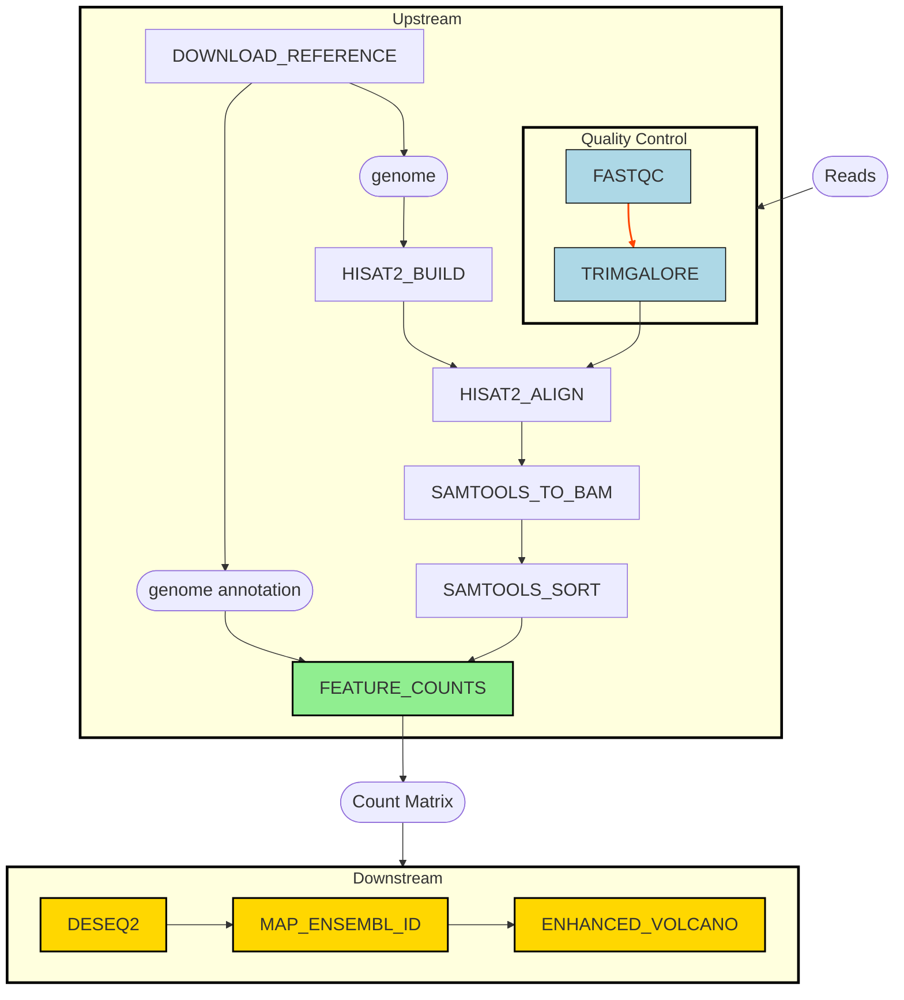

# Differential Gene Expression Analysis on Paired-end RNA-Seq Data

Author: Tony Liang

---

**Table of Contents**:

1. [Project Outline](#project-outline)
1. [Workflow Overview](#workflow-overview)
1. [Repository Structure](#directory-contents)
1. [Setup](#setup)
1. [Preparing Input](#preparing-input)
1. [Running Instructions](#running-instruction)
1. [Expected Pipeline Output](#pipeline-output)
1. [Reference](#reference)

## Project Outline

### Introduction

Technological advances have enabled easy access to high-throughput transcriptome seqeuncing (RNA-Seq). It provides far high coverage and greater resolution of dynamic nature of transcriptome compared to previous microarray-based methods like Sanger sequencing [1]. RNA-Seq allows us to compare specific conditions and understanding phenotypic variation through quantifying differentially expressed genes (DEGs) [2]. However, this process of from sequencing data to counts of DEGS could vary a lot depending input sequence data type, protocol or library strategy.  Due to these source of variations, there are many existing tools that identify DEGs from RNA-seq data, but not standardized as a modular, reproducible workflow. This modular feature allows simple replacement of tool to examine effects like alignment strategy, mapping reads, etc.

Here, we introduce a Nextflow pipeline **DGE-analysis** that takes in paired-end RNA-sequencing data in fastq format, transforming it all the way to gene counts matrix across different conditions from biological sample, and presenting nice volcano plot [3] of DEGs. 


### Workflow Overview


Above is the workflow steps overview of how from raw fastq files, we get to count matrix through list of bioinformatics tools (see [reference](#reference)) with these steps:

1. Given a pair of fastq reads of sequencing files, check their qualities through **FASTQC** and remove low quality reads with **TRIMGALORE**
2. At the same time, reference genome and its annotation are downloaded from the internet, the `genome` is a parameter of the pipeline, which can be any other url pointing to a homo-sapiens genome.
3. The genome index is built using **HISAT2** to allow for quicker location of query sequences in reference genome
4. Then aligned trimmed reads from 1. and the built genome index from 3. using **HISAT2**. This step is separated from 3. to decouple the indexing and alignment logic.
5. Then convert the aligned sequence alignment map (SAM) from 4. to binary alignment map (BAM) using **SAMTOOLS**, to have a compressed binary representation of 4.
6. Then sort 5. BAM using SAMTOOLS, again for the sake of decoupling logic of conversion of file formats and sorting
7. 


## Repository Structure

The following ilustrates the tree structure of this repository, those that ends with `/` symbol are directories, otherwise it is treated as a regular file. 

This structure is adapted from **nf-core** standard worfklow from the [rnaseq](https://github.com/nf-core/rnaseq/tree/master) repository.


<details>
  <summary>See the repository file structure (NEED TO UPDATE LATER) </summary>

```bash
./
├── Makefile
├── README.md
├── bin/
│   └── featureCounts.R*
├── conf/
│   ├── base.config
│   └── test.config
├── data/
│   ├── SRR29891674_sample_1.fastq.gz
│   ├── SRR29891674_sample_2.fastq.gz
│   ├── SRR29891675_sample_1.fastq.gz
│   ├── SRR29891675_sample_2.fastq.gz
│   ├── SRR29891677_sample_1.fastq.gz
│   ├── SRR29891677_sample_2.fastq.gz
│   ├── SRR29891678_sample_1.fastq.gz
│   ├── SRR29891678_sample_2.fastq.gz
│   └── samplesheet.csv
├── main.nf
├── modules/
│   ├── local/
│   │   ├── download_reference/
│   │   │   └── main.nf
│   │   ├── fastqc/
│   │   │   └── main.nf
│   │   ├── feature_counts/
│   │   │   └── main.nf
│   │   ├── hisat2/
│   │   │   ├── hisat2_align/
│   │   │   └── hisat2_build/
│   │   ├── samtools/
│   │   │   ├── samtools_sort/
│   │   │   └── samtools_to_bam/
│   │   └── trimgalore/
│   │       └── main.nf
│   └── nf-core/
│       └── main.nf
├── nextflow.config
└── run_nxf.sh*
```

</details>

### Directories

- `bin`: This directory contains **executable** binary scripts used in the processes, provided if you have the relevant binary installed like `Rscript` or `python3`. For more information please see [here](bin/README.md).

- `modules`: This directory contains nextflow processes definitions following these conventions:
    - `local/<tool_name>/main.nf`: `<tool_name>` would be an actual binary tool that could be treated as smallest unit software to use in the workflow, and contains implementation of using these tools based on its documentation/manual.
    - `nf-core/main.nf`: Code adapted from [nf-core/rnaseq](https://github.com/nf-core/rnaseq/blob/master/subworkflows/nf-core/utils_nextflow_pipeline/main.nf) under [MIT License](https://github.com/nf-core/rnaseq/blob/master/LICENSE), this stores standard code used across nf-core pipelines to record workflow/tools version numbers and some useful utilities.
    - For more information, see the [README here](./modules/README.md)

- `data`: This directory contains a test samplesheet csv (input of the workflow) and other small test data to run the workflow. For more detail documentation on how these data were gathered, please the the [README here](./data/README.md)

- `conf`: This directory contains nextflow configuration parameters, it is design to store different profiles (i.e. running the pipeline under different infrastructure setting). This follows nf-core standard practice, where these configs are then just sourced in the main [top-level configuration](./nextflow.config) upon command-line usage. For more information, see [README here](./conf/README.md)
    - [`base.config`](./conf/base.config): This is basic configuration that declares resource usages, and it is intended to be overridden by other profiles
    - [`test.config`](./conf/test.config): This is configuration designed to be run on small dataset (i.e. our sample data this case), with limited resource settings


## Setup

There are some software dependencies in order to run this pipeline, corresponding softwares and versions are tested in the following:

```bash
# <sofware>-<version_number>
bash-5.1.16
jave-11.0.22
Docker--20.10.23
git-2.34.1
nextflow-24.04.4
```

Other tools used in the pipeline are from public repository docker images retrieved mostly from the [biocontainers organization](https://quay.io/organization/biocontainers)

For a list of software images used in this pipeline see the configuration file [here](nextflow.config) under the `process` scope.

### Preparing Input

First, prepare a samplesheet with your input data that looks as follows:

**data/samplesheet.csv**:

```csv
sample_name,condition,rep,fastq1,fastq2
SRR29891678,control,rep1,data/SRR29891678_sample_1.fastq.gz,data/SRR29891678_sample_2.fastq.gz
SRR29891677,control,rep2,data/SRR29891677_sample_1.fastq.gz,data/SRR29891677_sample_2.fastq.gz
SRR29891675,treatment,rep1,data/SRR29891675_sample_1.fastq.gz,data/SRR29891675_sample_2.fastq.gz
SRR29891674,treatment,rep2,data/SRR29891674_sample_1.fastq.gz,data/SRR29891674_sample_2.fastq.gz
```

The `sample_name` here represents sequence read archive (SRA) accession code, in this case, `SRR*` are sequencing runs from NCBI's database. And, this samplesheet should also contain information like is the condition that sample represents (one of control or treatment), and its biological replicate number
with prefix `rep`. Lastly, it should have two columns indicating path to the `fastq.gz` of both read1 and read2, as the pipeline required paired-end sequencing data.

For more information of how this samplesheet was constructed, see its [README here](data/README.md).

### Running Instruction

First, clone the this github repository and change the working directory to the clone repo using:

```bash
# Assuming you use one of bash/zsh or other unix systems
# NO Powershell
git clone https://github.com/tonyliang19/biof501-project.git
cd biof501-project/
```

Then the pipeline could be run as the following using a test data contained already in this repository:

```bash
# The outdir could also be replace to some other directory of your preference
nextflow run main.nf \
    --samplesheet data/samplesheet.csv \
    --outdir results \
    -profile docker,test
```

Overall the running command should follow this structure:

```bash
nextflow run main.nf \
    --samplesheet <SOME_SAMPLESHEET_CSV> \
    --outdir <OUTDIR> \
    -profile docker,test
```

where `<SOME_SAMPLESHEET_CSV>` is the csv data that follows format in [preparing-input section](#preparing-input) and `OUTDIR` being the directory you want the output files to store.

> [!NOTE]
> The pipeline should take some time run for the very first time, because of the containerized images it have to pull from internet, and downloads of some reference data
>
> Also the profile there should be NO SPACE, i.e.:
>
> -profile docker,test works
>
> -profile docker, test DO NOT WORK


## Pipeline Output

**TODO**: this section should add some sample output

## Reference

### Literature

[1] Kukurba, Kimberly R., and Stephen B. Montgomery. "RNA sequencing and analysis." Cold Spring Harbor Protocols 2015.11 (2015): pdb-top084970.

[2] Costa-Silva, Juliana, Douglas Domingues, and Fabricio Martins Lopes. "RNA-Seq differential expression analysis: An extended review and a software tool." PloS one 12.12 (2017): e0190152.

[3] Li, Wentian. "Volcano plots in analyzing differential expressions with mRNA microarrays." Journal of bioinformatics and computational biology 10.06 (2012): 1231003.


### Nextflow tools

- [nf-core](https://pubmed.ncbi.nlm.nih.gov/32055031/)

    > Ewels PA, Peltzer A, Fillinger S, Patel H, Alneberg J, Wilm A, Garcia MU, Di Tommaso P, Nahnsen S. The nf-core framework for community-curated bioinformatics pipelines. Nat Biotechnol. 2020 Mar;38(3):276-278. doi: 10.1038/s41587-020-0439-x. PubMed PMID: 32055031.

- [Nextflow](https://pubmed.ncbi.nlm.nih.gov/28398311/)

    > Di Tommaso P, Chatzou M, Floden EW, Barja PP, Palumbo E, Notredame C. Nextflow enables reproducible computational workflows. Nat Biotechnol. 2017 Apr 11;35(4):316-319. doi: 10.1038/nbt.3820. PubMed PMID: 28398311.

Pipeline tools

- [FastQC](https://www.bioinformatics.babraham.ac.uk/projects/fastqc/)

  > Andrews, S. (2010). FastQC: A Quality Control Tool for High Throughput Sequence Data [Online].


- [HISAT2](https://pubmed.ncbi.nlm.nih.gov/31375807/)

  > Kim D, Paggi JM, Park C, Bennett C, Salzberg SL. Graph-based genome alignment and genotyping with HISAT2 and HISAT-genotype Graph-based genome alignment and genotyping with HISAT2 and HISAT-genotype. Nat Biotechnol. 2019 Aug;37(8):907-915. doi: 10.1038/s41587-019-0201-4. Epub 2019 Aug 2. PubMed PMID: 31375807.


- [SAMtools](https://pubmed.ncbi.nlm.nih.gov/19505943/)

  > Li H, Handsaker B, Wysoker A, Fennell T, Ruan J, Homer N, Marth G, Abecasis G, Durbin R; 1000 Genome Project Data Processing Subgroup. The Sequence Alignment/Map format and SAMtools. Bioinformatics. 2009 Aug 15;25(16):2078-9. doi: 10.1093/bioinformatics/btp352. Epub 2009 Jun 8. PubMed PMID: 19505943; PubMed Central PMCID: PMC2723002.


- [Trim Galore!](https://www.bioinformatics.babraham.ac.uk/projects/trim_galore/)

  > Krueger, Felix. "Trim Galore!: A wrapper around Cutadapt and FastQC to consistently apply adapter and quality trimming to FastQ files, with extra functionality for RRBS data." Babraham Institute (2015).


### R packages

- [R](https://www.R-project.org/)

  > R Core Team (2017). R: A language and environment for statistical computing. R Foundation for Statistical Computing, Vienna, Austria.

- [DESeq2](https://pubmed.ncbi.nlm.nih.gov/25516281/)

  > Love MI, Huber W, Anders S. Moderated estimation of fold change and dispersion for RNA-seq data with DESeq2. Genome Biol. 2014;15(12):550. PubMed PMID: 25516281; PubMed Central PMCID: PMC4302049.

- [EnhancedVolcano](https://doi.org/10.18129/B9.bioc.EnhancedVolcano)

  > Blighe K, Rana S, Lewis M (2023). _EnhancedVolcano: Publication-ready
  volcano plots with enhanced colouring and labeling_.
  doi:10.18129/B9.bioc.EnhancedVolcano
  <https://doi.org/10.18129/B9.bioc.EnhancedVolcano>, R package version
  1.20.0, <https://bioconductor.org/packages/EnhancedVolcano>.

- [ggplot2](https://cran.r-project.org/web/packages/ggplot2/index.html)

  > H. Wickham. ggplot2: Elegant Graphics for Data Analysis. Springer-Verlag New York, 2016.

- [RColorBrewer](https://CRAN.R-project.org/package=RColorBrewer)

  > Erich Neuwirth (2014). RColorBrewer: ColorBrewer Palettes.

- [Rsubread](https://bioconductor.org/packages/release/bioc/html/Rsubread.html)

  > Liao Y, Smyth GK and Shi W (2019). The R package Rsubread is easier,
  faster, cheaper and better for alignment and quantification of RNA
  sequencing reads. Nucleic Acids Research 47(8), e47.

### Software packaging/containerisation tools


- [BioContainers](https://pubmed.ncbi.nlm.nih.gov/28379341/)

  > da Veiga Leprevost F, Grüning B, Aflitos SA, Röst HL, Uszkoreit J, Barsnes H, Vaudel M, Moreno P, Gatto L, Weber J, Bai M, Jimenez RC, Sachsenberg T, Pfeuffer J, Alvarez RV, Griss J, Nesvizhskii AI, Perez-Riverol Y. BioContainers: an open-source and community-driven framework for software standardization. Bioinformatics. 2017 Aug 15;33(16):2580-2582. doi: 10.1093/bioinformatics/btx192. PubMed PMID: 28379341; PubMed Central PMCID: PMC5870671.

- [Docker](https://dl.acm.org/doi/10.5555/2600239.2600241)

  > Merkel, D. (2014). Docker: lightweight linux containers for consistent development and deployment. Linux Journal, 2014(239), 2. doi: 10.5555/2600239.2600241.

- [Singularity](https://pubmed.ncbi.nlm.nih.gov/28494014/)

  > Kurtzer GM, Sochat V, Bauer MW. Singularity: Scientific containers for mobility of compute. PLoS One. 2017 May 11;12(5):e0177459. doi: 10.1371/journal.pone.0177459. eCollection 2017. PubMed PMID: 28494014; PubMed Central PMCID: PMC5426675.
